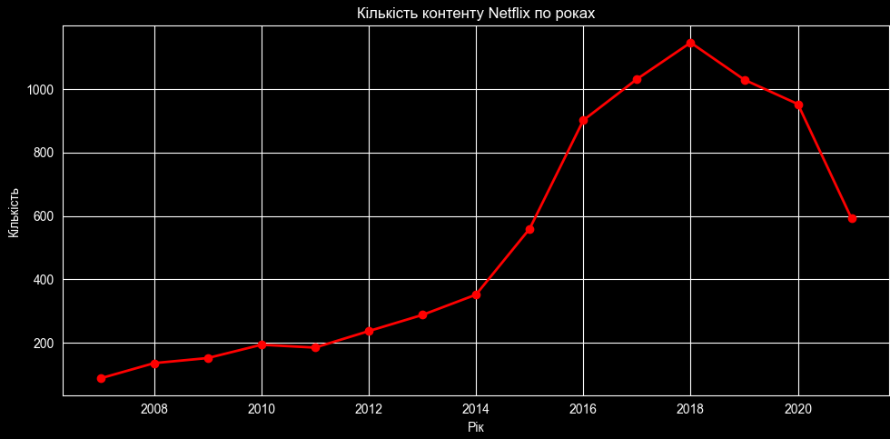
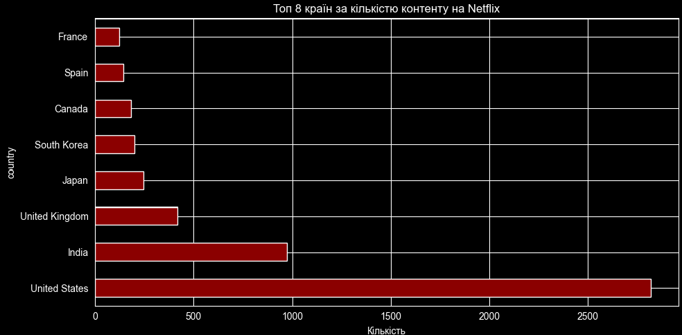
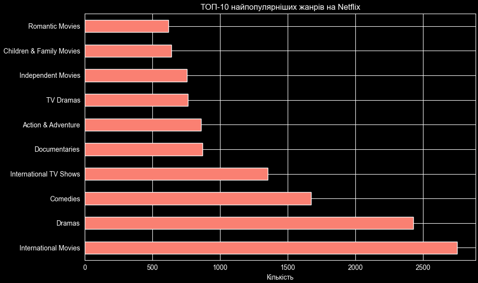

# netflix-analysis
EDA аналіз датасету Netflix за допомогою Pandas
# 🎬 Netflix Content Analysis

Аналіз датасету Netflix (8807 фільмів та серіалів) за допомогою Python та Pandas.

---

## 📌 Опис проєкту

Даний проєкт є навчальним EDA (Exploratory Data Analysis) — дослідженням даних Netflix.  
Мета: навчитись працювати з реальними даними — очищати, аналізувати та візуалізувати їх за допомогою Pandas та Matplotlib.

---

## 📊 Датасет

- **Джерело:** [Kaggle — Netflix Movies and TV Shows](https://www.kaggle.com/datasets/shivamb/netflix-shows)
- **Розмір:** 8807 рядків, 12 колонок
- **Колонки:** `show_id`, `type`, `title`, `director`, `cast`, `country`, `date_added`, `release_year`, `rating`, `duration`, `listed_in`, `description`

---

## 🛠 Технології

- Python 3.x
- Pandas 3.0.3
- Matplotlib

---

## 🔍 Що було зроблено

### 1. Завантаження та дослідження даних
- Завантажено CSV файл через `pd.read_csv()`
- Досліджено структуру: `shape`, `info()`, `describe()`
- Виявлено пропуски за допомогою `isnull().sum()`

### 2. Очищення даних
- Знайдено 2634 пропуски в колонці `director`
- Всі текстові пропуски заповнено значенням `'Unknown'` через `fillna()`
- Колонка `date_added` конвертована в тип `datetime`

### 3. Аналіз даних

| Питання | Результат |
|---|---|
| Який тип контенту переважає? | Фільми (6131) vs Серіали (2676) |
| Яка країна виробляє найбільше контенту? | США (2818), Індія (972) |
| Який рейтинг найпоширеніший? | TV-MA (3207) |
| Який місяць найактивніший? | Липень (827 додавань) |
| Який жанр найпопулярніший? | International Movies (2752) |

### 4. Візуалізація
- 📈 Лінійний графік росту контенту по роках
- 📊 Горизонтальний бар чарт топ-8 країн
- 📊 Горизонтальний бар чарт топ-10 жанрів

---

## 📈 Графіки

### Кількість контенту по роках


### Топ-8 країн


### Топ-10 жанрів


---

## 🚀 Як запустити

1. Клонувати репозиторій:
```bash
git clone https://github.com/YOUR_USERNAME/netflix-analysis.git
```

2. Встановити залежності:
```bash
pip install pandas matplotlib
```

3. Потрібно завантажити датасет з [Kaggle](https://www.kaggle.com/datasets/shivamb/netflix-shows) і покласти `netflix_titles.csv` в папку проєкту

4. Відкрити і запустити `netflix_analysis.ipynb`

---

## 💡 Висновки

- Netflix орієнтується переважно на **дорослу аудиторію** (рейтинг TV-MA)
